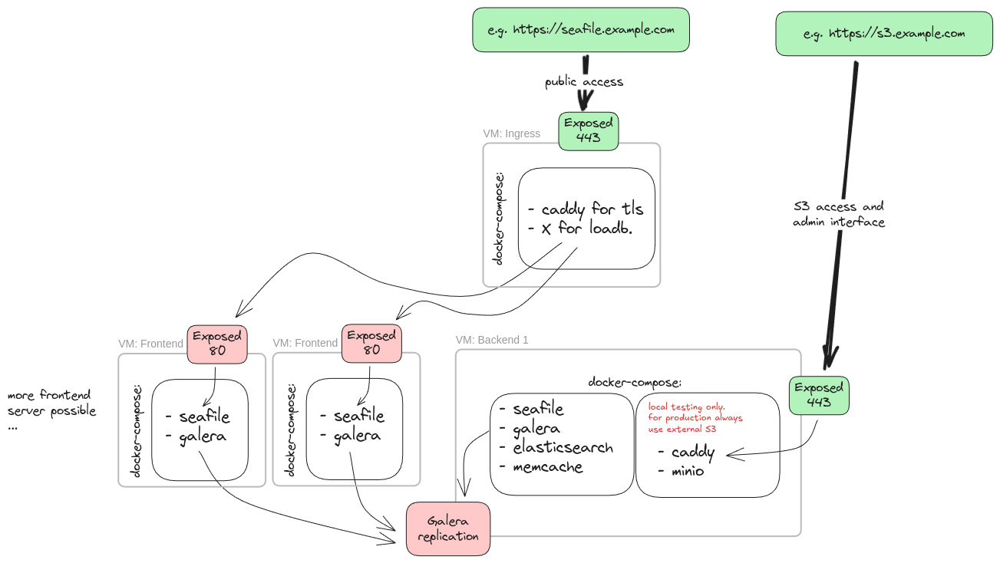

# Seafile Cluster

This document describes how to set up a Seafile cluster using Docker. The following instructions assume that you're using the S3 storage backend.

## Architecture



## Prerequisites
- 4 VMs inside a private network
    - seafile-loadbalancer
    - seafile-backend
    - seafile-frontend-1
    - seafile-frontend-2
- S3
    - Buckets: `seafile-blocks`, `seafile-commits`, `seafile-fs`

## Instructions

### seafile-loadbalancer

This node handles TLS termination and distributes the load among the frontend nodes.

**Note:** These configuration settings are **not** part of this document. The following example is **only included for demonstrative purposes**.

#### docker-compose.yml

```yml
services:
  caddy:
    image: caddy:2.8.4
    restart: unless-stopped
    environment:
      - SEAFILE_SERVER_HOSTNAME=${SEAFILE_SERVER_HOSTNAME}
      - SEAFILE_FRONTEND_1_IP=${SEAFILE_FRONTEND_1_IP}
      - SEAFILE_FRONTEND_2_IP=${SEAFILE_FRONTEND_2_IP}
    ports:
      - "80:80"
      - "443:443"
    volumes:
      - /opt/caddy:/data
      - ./Caddyfile:/etc/caddy/Caddyfile
```

#### Caddyfile

```Caddyfile
{$SEAFILE_SERVER_HOSTNAME}

reverse_proxy {$SEAFILE_FRONTEND_1_IP}:80 {$SEAFILE_FRONTEND_2_IP}:80 {
  # Maps the client IP to a sticky upstream
  lb_policy client_ip_hash

	# Enable active healthchecks
	health_uri /api2/ping/

	# Enable passive healthchecks
	fail_duration 30s
}
```

#### .env
```ini
SEAFILE_SERVER_HOSTNAME=

# These should be private IP addresses
SEAFILE_FRONTEND_1_IP=
SEAFILE_FRONTEND_2_IP=
```

Then:

```bash
docker compose up -d
```

### seafile-backend

1. Follow instructions in [README.md](./README.md)
2. Modify `.env`:
    ```ini
    COMPOSE_FILE='seafile-pe-cluster-backend.yml,galera.yml'

    # TODO: Configure these variables
    SEAFILE_SERVER_HOSTNAME=
    SEAFILE_ADMIN_EMAIL=
    SEAFILE_ADMIN_PASSWORD=
    SEAHUB__SECRET_KEY=
    SEAFILE__notification__jwt_private_key=

    # Private IP address of memcached host
    MEMCACHED_HOST=

    # Set secure values
    MARIADB_GALERA_MARIABACKUP_PASSWORD=
    MARIADB_ROOT_PASSWORD=
    MARIADB_REPLICATION_PASSWORD=

    # Cluster should be bootstrapped by seafile-backend
    MARIADB_GALERA_CLUSTER_BOOTSTRAP='yes'

    # Private IP address of seafile-backend
    SEAFILE_CLUSTER_0_IP=
    # Private IP address of seafile-frontend-1
    SEAFILE_CLUSTER_1_IP=
    # Private IP address of seafile-frontend-2
    SEAFILE_CLUSTER_2_IP=
    
    SEAFILE_CLUSTER_0_NAME=
    SEAFILE_CLUSTER_1_NAME=
    SEAFILE_CLUSTER_2_NAME=
    MARIADB_GALERA_CLUSTER_NAME=

    NODE_PRIVATE_HOSTNAME=${SEAFILE_CLUSTER_0_NAME}
    NODE_PRIVATE_IP=${SEAFILE_CLUSTER_0_IP}
    ```
3. Create `/opt/seafile-compose/seafile_storage_classes.json` (-> [Storage Class Configuration](#storage-class-configuration))
4. Start services: `docker compose up -d`

**Note:** `seafile-backend` must be started before `seafile-frontend-{1,2}` since it is configured to bootstrap the Galera cluster and create/seed the Seafile databases

### seafile-frontend-1

1. Follow instructions in [README.md](./README.md)
2. Modify `.env`:
    ```ini
    COMPOSE_FILE='seafile-pe-cluster-frontend.yml,galera.yml'

    # The following variables must have the same values as seafile-backend:
    SEAFILE_SERVER_HOSTNAME=
    SEAFILE_ADMIN_EMAIL=
    SEAFILE_ADMIN_PASSWORD=
    SEAHUB__SECRET_KEY=
    SEAFILE__notification__jwt_private_key=

    # Private IP address of your elasticsearch host
    ELASTICSEARCH_HOST=

    # Private IP address of memcached host
    MEMCACHED_HOST=

    # The following variables must have the same values as seafile-backend:
    MARIADB_GALERA_MARIABACKUP_PASSWORD=
    MARIADB_ROOT_PASSWORD=
    MARIADB_REPLICATION_PASSWORD=

    # Cluster should be bootstrapped by seafile-backend
    MARIADB_GALERA_CLUSTER_BOOTSTRAP='no'

    # Private IP address of seafile-backend
    SEAFILE_CLUSTER_0_IP=
    # Private IP address of seafile-frontend-1
    SEAFILE_CLUSTER_1_IP=
    # Private IP address of seafile-frontend-2
    SEAFILE_CLUSTER_2_IP=

    SEAFILE_CLUSTER_0_NAME=
    SEAFILE_CLUSTER_1_NAME=
    SEAFILE_CLUSTER_2_NAME=
    MARIADB_GALERA_CLUSTER_NAME=

    NODE_PRIVATE_HOSTNAME=${SEAFILE_CLUSTER_1_NAME}
    NODE_PRIVATE_IP=${SEAFILE_CLUSTER_1_IP}
    ```
3. Create `/opt/seafile-compose/seafile_storage_classes.json` (-> [Storage Class Configuration](#storage-class-configuration))
4. Start services: `docker compose up -d`

### seafile-frontend-2

Same instructions as for `seafile-frontend-1`. Only the values of `NODE_PRIVATE_{HOSTNAME,IP}` need to be different:
```ini
NODE_PRIVATE_HOSTNAME=${SEAFILE_CLUSTER_2_NAME}
NODE_PRIVATE_IP=${SEAFILE_CLUSTER_2_IP}
```

## Storage Class Configuration

Configure `host` (without protocol, e.g. `s3.seafile-demo.de`), `key_id` and `key`:

```json
[
    {
      "storage_id": "S3",
      "name": "S3",
      "is_default": true,
      "commits": {
        "backend": "s3",
        "host": "",
        "use_https": true,
        "bucket": "seafile-commits",
        "key_id": "",
        "key": "",
        "path_style_request": true
      },
      "fs": {
        "backend": "s3",
        "host": "",
        "use_https": true,
        "bucket": "seafile-fs",
        "key_id": "",
        "key": "",
        "path_style_request": true
      },
      "blocks": {
        "backend": "s3",
        "host": "",
        "use_https": true,
        "bucket": "seafile-blocks",
        "key_id": "",
        "key": "",
        "path_style_request": true
      }
    }
]
```

Please refer to [Seafile S3 Backend](https://manual.seafile.com/deploy_pro/setup_with_amazon_s3/) for detailed information.

## Add-On: MinIO

Requirement: `caddy-docker-proxy` on the same host (-> [`caddy.yml`](./compose/caddy.yml))

Add `caddy.yml,minio.yml` to `COMPOSE_FILE` inside `.env` on `seatable-backend`

### minio.yml
```yml
services:
  minio:
    container_name: minio
    image: quay.io/minio/minio
    networks:
      - frontend-net
    volumes:
      - '/opt/minio_data:/data'
    environment:
      # TODO
      - MINIO_ROOT_USER=
      - MINIO_ROOT_PASSWORD=
      - MINIO_SERVER_URL=https://s3.seafile-demo.de
      - MINIO_BROWSER_REDIRECT_URL=https://s3.seafile-demo.de/console
    command: server /data --console-address ":9090"
    labels:
      # TODO
      caddy: s3.seafile-demo.de
      caddy.redir: /console /console/
      caddy.reverse_proxy: "{{upstreams 9000}}"
      caddy.handle_path: /console/*
      caddy.handle_path.0_reverse_proxy: "{{upstreams 9090}}"

networks:
  frontend-net:
    name: frontend-net
```

To create the three buckets easily, you can simply create the necessary folders (works only in standalone FS mode, so never us this in production).
```
mkdir -p /opt/minio_data/{seafile-blocks,seafile-commits,seafile-fs}
```

Or you do it the docker way:

```
createbuckets:
    container_name: createbuckets
    image: minio/mc
    depends_on:
      - minio
    entrypoint: >
      /bin/sh -c "
      /usr/bin/mc config host add myminio http://minio:9000 root your-password-used-for-MINIO_ROOT_PASSWORD;
      /usr/bin/mc mb myminio/seafile-commits;
      /usr/bin/mc mb myminio/seafile-blocks;
      /usr/bin/mc mb myminio/seafile-fs;
      exit 0;
      "
    networks:
      - frontend-net
```


You can use the values of `MINIO_ROOT_USER/PASSWORD` as `key_id`/`key` in `seafile_storage_classes.json` **for testing purposes**.
